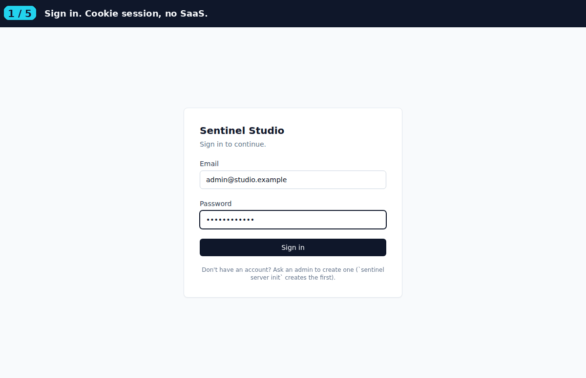

# Sentinel

> Point it at a URL. It explores the app, generates a test plan, runs it, and reports failed scenarios, visual regressions, accessibility violations, and REST API contract findings.

[](https://pypi.org/project/sentinel-agent/)
[](https://opensource.org/licenses/MIT)
[](#roadmap)
[](https://thinknextsoftware.com)

> **Status**: beta, live on PyPI as `sentinel-agent` (latest 0.1.x). Standalone: zero runtime dependency on any other ThinkNext package. Web functional testing + self-healing + visual regression + WCAG 2.1 AA accessibility + REST API contract tests all ship today. Mobile (React Native) is planned for a future release.
>
> **Install**: `pip install 'sentinel-agent[anthropic]'` (or `[claude-code]`, `[openai]`, `[google]`, `[all]`). **Repo**: [GitHub](https://github.com/Thinknext-Software-Solutions/Sentinel). **Issues**: [file one](https://github.com/Thinknext-Software-Solutions/Sentinel/issues).

## What it does

Point Sentinel at a URL:

```bash
sentinel run https://your-app.com
```

In one command, the agent:

1. **Opens** the URL in headless Chromium
2. **Reads** the rendered HTML + visible text
3. **Asks the LLM** to generate a focused test plan (2-5 scenarios, 3-8 steps each)
4. **Runs** the plan in fresh browser sessions per scenario
5. **Captures** screenshots and compares against baselines (visual regression)
6. **Scans** each page state for WCAG 2.1 AA violations (axe-core)
7. **Reports** findings: failed scenarios, visual diffs, accessibility issues, with cost

## Why this exists

The same teams that need [Cascade](https://cascadeagent.dev) (meeting-to-PR) and [Relay](https://github.com/Thinknext-Software-Solutions/Relay) (issue-to-PR) need a way to verify that the PRs those agents produce actually work. Hand-writing Playwright tests for every feature is the bottleneck. Sentinel removes the bottleneck: generate tests with the same LLM that writes the code.

Sentinel is fully standalone. It carries its own LLM-client layer and config so it does not depend on any other ThinkNext package at runtime.

## Install

```bash
# Core install + the LLM provider you want:
pip install 'sentinel-agent[anthropic]'        # Anthropic Claude
pip install 'sentinel-agent[openai]'           # OpenAI
pip install 'sentinel-agent[google]'           # Google Gemini
pip install 'sentinel-agent[claude-code]'      # Local Claude Code subscription, no API key
pip install 'sentinel-agent[all]'              # All providers

# One-time: install the Chromium binary Playwright needs
playwright install chromium
```

## Configure

```bash
# Set up an LLM provider. Credentials live at ~/.config/sentinel/config.yaml.
sentinel configure llm anthropic --key sk-ant-xxx --set-default

# Or, if you have Claude Code installed locally (no API key needed):
sentinel configure llm claude_code --set-default
```

If you want a project-local config (highly recommended; lets you set viewport, baseline directory, accessibility thresholds):

```bash
sentinel init
```

This scaffolds `sentinel.yaml` with sensible defaults you can edit.

## Sentinel Studio (web UI, multi-user)

For teams who want a UI instead of the CLI alone, Sentinel ships with **Studio**: a self-hosted web app for projects, runs, history, and user management. Single SQLite database, runs in your network, no SaaS account.

```bash
pip install 'sentinel-agent[server,anthropic]'   # or [server,claude-code], etc.
sentinel server init                              # prompts for admin email + password
sentinel server up                                # http://127.0.0.1:8000
```

Three global roles: **admin** (manage users + everything), **member** (create projects, trigger runs), **viewer** (read-only). All state lives at `~/.local/share/sentinel/studio.db` (override with `SENTINEL_SERVER_HOME`).



Studio re-uses your existing LLM credentials from `~/.config/sentinel/config.yaml`, so a project that says "provider: claude_code" will run for free if your subscription is configured. Studio is bundled as an optional install extra (`[server]`) so the core CLI install stays slim. The frontend is React + Vite + TanStack Query, served from the same FastAPI app via a SPA fallback.

## CLI: run against a URL


```bash
sentinel run https://cascadeagent.dev

# Output (truncated):
#   ✓  3/3 scenarios passed, 0 visual diff(s), 2 a11y violation(s)
#
#   ✓  Homepage loads and primary CTA is visible  (1.42s)
#   ✓  Get-started link navigates to /getting-started/  (1.83s)
#   ✓  Docs sidebar contains all expected sections  (2.10s)
#
#   Accessibility violations:
#     [moderate] color-contrast: Elements must meet minimum color contrast...
#       sample: .text-slate-500
#       (3 node(s) affected)
#     [minor] image-alt: Images must have alt text...
#       sample: img.hero-illustration
#       (1 node(s) affected)
#
#   cost:    $0.04 (5,210 in / 980 out tokens)
```

## What ships in v0.1.0

| Capability | Module |
|---|---|
| Web testing via Playwright | `sentinel.browser`, `sentinel.runner` |
| LLM-driven test plan generation | `sentinel.planner` |
| Self-healing tests (LLM re-plan on failed step + retry once) | `sentinel.planner.regenerate_step` |
| Multi-page exploration (up to 4 same-origin links) | `sentinel.agent` |
| Visual regression (PIL pixel diff) | `sentinel.visual` |
| Accessibility scan (axe-core 4.10, WCAG 2.1 AA) | `sentinel.a11y` |
| REST API contract testing (OpenAPI + URL-probe modes) | `sentinel.api_*` |
| Multi-LLM (Anthropic / OpenAI / Google / Claude Code / Ollama) | `sentinel.llm` |
| **Studio (web UI, multi-user, SQLite-backed)** | `sentinel.server` (new in 0.2) |
| Mobile (React Native via Detox) | planned for a future release |

## How it differs from existing tools

| | Playwright Codegen | Pytest + Playwright | Percy / Chromatic | Sentinel |
|---|---|---|---|---|
| Generates tests from a URL | partial (record/replay) | ❌ | ❌ | ✅ |
| Self-hosted | ✅ | ✅ | ❌ | ✅ |
| Bring your own LLM | n/a | n/a | n/a | ✅ |
| Visual regression | ❌ | ❌ | ✅ | ✅ |
| Accessibility scan | ❌ | partial (plugin) | ❌ | ✅ |
| Open source | ✅ | ✅ | ❌ | ✅ |

Sentinel is for teams who want test coverage without spending the engineering hours to author it. The trade-off is that AI-generated tests have failure modes hand-written tests do not (e.g. an LLM picks a fragile selector). The self-healing path is the answer to that: on a failed step, the runner asks the LLM for a more specific selector with the failure context and retries once.

## Configuration

`sentinel.yaml` (after `sentinel init`):

```yaml
version: 1

agent:
  provider: anthropic
  model: claude-opus-4-7
  temperature: 0.2

browser:
  headless: true
  viewport_width: 1280
  viewport_height: 720
  timeout_ms: 30000

visual:
  enabled: true
  baseline_dir: sentinel-baselines
  diff_threshold_percent: 0.5

a11y:
  enabled: true
  fail_on:
    - critical
    - serious
```

## Architecture

```
   sentinel run <url>
          │
          ▼
   ┌──────────────┐
   │ explore page │  Playwright opens URL, grabs HTML + visible text
   └──────┬───────┘
          │
          ▼
   ┌──────────────┐
   │   planner    │  LLM produces TestPlan (2-5 scenarios, 3-8 steps each)
   └──────┬───────┘
          │
          ▼
   ┌──────────────┐
   │    runner    │  Fresh browser session per scenario
   │              │  Each step is one Playwright action
   │              │  screenshot steps → visual regression check
   │              │  a11y_scan steps → axe-core injection
   └──────┬───────┘
          │
          ▼
   ┌──────────────┐
   │ SentinelReport │  Scenarios + visual diffs + a11y violations + cost
   └──────────────┘
```

## License

MIT. See [LICENSE](LICENSE).

## About

Built and maintained by [ThinkNext Software Solutions](https://thinknextsoftware.com), alongside our other open-source projects [Cascade](https://cascadeagent.dev) (meeting-to-PR) and [Relay](https://github.com/Thinknext-Software-Solutions/Relay) (issue-to-PR).

Follow along: [@ThinkNextHQ](https://twitter.com/ThinkNextHQ) &middot; [LinkedIn](https://linkedin.com/company/thinknextsoftware) &middot; [Blog](https://thinknextsoftware.com/blog/)
